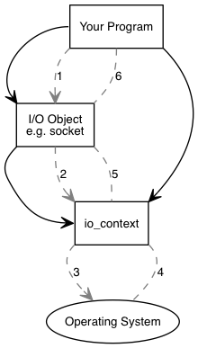
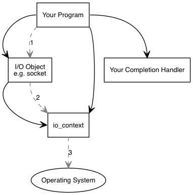
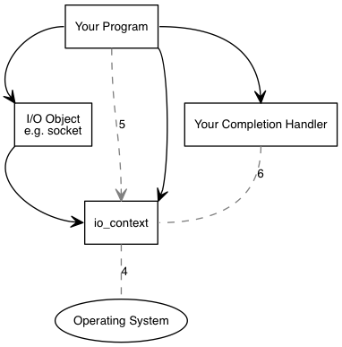

### boost asio可以被用来在一个IO对象(如 socket)上面执行同步和异步操作, 在使用boost asio之前,了解asio的各个部分,以及它们如何协同工作的概念图可能会很有用
### 作为介绍性示例,考虑在socket上执行连接操作时会发生什么, 我们将从检查同步操作开始


### 应用程序至少有一个 `io_context` 对象, 这个`io_context`代表应用程序到系统IO服务的链接
``` c++
boost::asio::io_context io_context;
```
### 应用程序需要一个IO对象来执行IO操作, 例如 tcp socket
``` c++
boost::asio::ip::tcp::socket socket{io_context};
```
# 当一个同步连接操作被执行时, 会发生以下的事件序列
1. 应用程序通过调用IO对象来启动连接操作
    ``` c++
    socket.connect(server_endpoint);
    ```
2. IO 对象向`io_context`转发请求
3. `io_conetxt`要求操作系统执行连接操作
4. 操作系统向`io_context`返回操作结果
5. `io_context`将操作产生的错误转换为`boost :: system :: error_code`类型的对象, 然后将结果转发回IO对象,  `error_code`可以和一个被指定的值比较, 或者被当作一个布尔值(一个`false`值表示没有错误发生)
6. 如果操作失败, IO对象抛出`boost::system::system_error`类型的异常, 如果启动连接的操作的代码改写成这个样子
    ``` c++
    boost::system::error_code ec;
    socket.connect(server_endpoint, ec); 
    ```
    ec被设置为操作结果, 且不会有异常抛出

# 当使用异步操作时, 会发生不同的事件序列


1. 应用程序通过调用IO对象发起连接操作
   ``` c++
    socket.async_connect(server_endpoint, your_completion_handler);
   ```
    `your_completion_handler`是带有特定签名的函数或者函数对象
    ``` c++
        void your_completion_handler(const boost::system::error_code& ec);
    ```
    准确的函数签名取决于被执行的异步操作(参阅api文档)
2. IO对象向`io_context`转发请求
3. `io_context`向操作系统发出信号，表明它应该启动异步连接, 在同步方式下会一直等待直到完成连接

4. 操作系统通过把异步操作的结果放入队列中来指明连接操作已经完成, 准备被`io_context`提取
5. 应用程序必须调用`io_context::run()`或类似的`io_context`成员函数为了抽取异步操作的结果, 当有未完成的异步操作时`io_context::run()`调用将会被阻塞,通常会在开始首次异步操作后立即调用它
6. 在`io_context::run()`内部, `io_context`从队列中取出异步操作的结果, 转换成`error_code`, 然后把它传递给`your_completion_handler`
   
# 以上即是 boost asio如何运作的简化图,如果需求更加高级则需要进一步研究文档, 例如扩展asio以执行其他类型的异步操作

