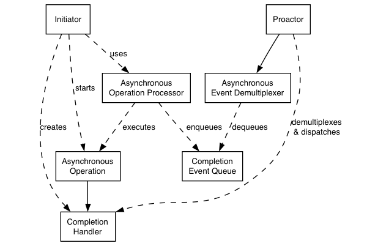

### boost asio提供了对同步和异步操作的并行支持, 异步操作基于Proactor设计模式, 与仅同步的方式或Reactor相比, 此方法的优缺点概述如下
# *Proactor and Boost.Asio*
### 不涉及到特定平台的细节, 来看看asio中的Proactor设计模式是如何被实现的

#### proactor 设计模式
* ## Asynchronous Operation 
    > ###  定义一个被异步执行的操作, 例如异步读或者写一个套接字
* ## Asynchronous Operation Processor 
    > ###  执行异步操作，并在操作完成时将事件排队在完成事件队列上, 从高级的角度来看，像reactive_socket_service这样的内部服务就是异步操作处理器
* ## Completion Event Queue 
    > ### 缓冲异步操作完成的事件，直到它们被异步事件多路分解器出队
* ## Completion Handler
    > ### 处理异步操作的结果,它们是函数对象, 经常使用`std::bind`或者`boost::bind`创建
* ## Asynchronous Event Demultiplexer
    > ### 阻塞, 等待完成事件队列上的时间发生, 返回一个完成的事件给其调用者
* ## Proactor
    > ### 调用异步事件多路分解器出队事件, 调度与事件关联的完成处理程序（即调用函数对象）,此抽象由`io_context`类表示
* ## Initiator
    > ### 启动异步操作的特定应用程序代码,通过高级接口类似于 basic_stream_socket 与异步操作处理器交互,依次委托给诸如reactive_socket_service之类的服务

# *Implementation Using Reactor*
### 在许多平台上, asio根据reactor实现proactor设计模式, 例如 `select epoll kqueue`, 这种实现方法与Proactor设计模式相对应，如下所示
* ## Asynchronous Operation Processor
    > ### 